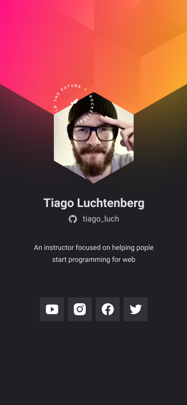

<h1 align="center">
  
</h1>

<p align="center">
  

 
</p>


## 💻 Projeto
Cracha virtual de apresentação .


## :hammer_and_wrench: Features 

-   [ ] HTML
-   [ ] CSS
-   [ ] Google-Fonts


## 🔖 Layout

Você pode visualizar o layout do projeto através [desse link](https://www.figma.com/file/XO94jxdkK17zewrAFZ0DjG/%5BNLW-Heat---Mission%3A-Origin%5D-DoWhile2021-(Community)?node-id=61313%3A4661). É necessário ter conta no [Figma](http://figma.com/) para acessá-lo.


## Executando o projeto

Utilize o **Live Server** ou abra no navegador web
```cl
no arquivo index.html

```

<br />

<div align="center">
  <small>Desenvolvido por David Bernardo  - Outubro/2021</small>

  
</div>
